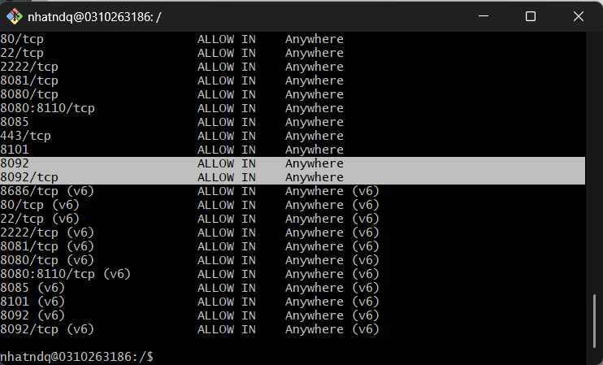
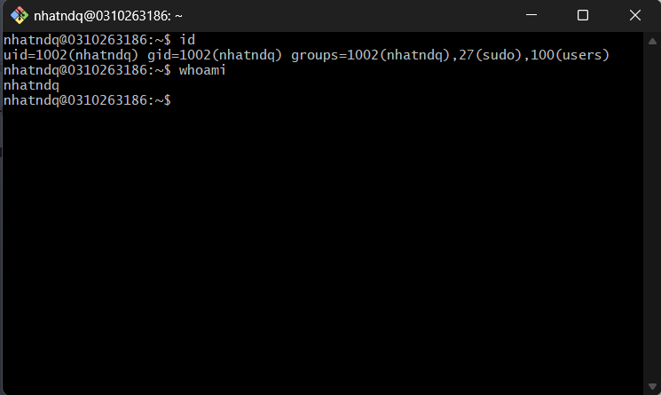
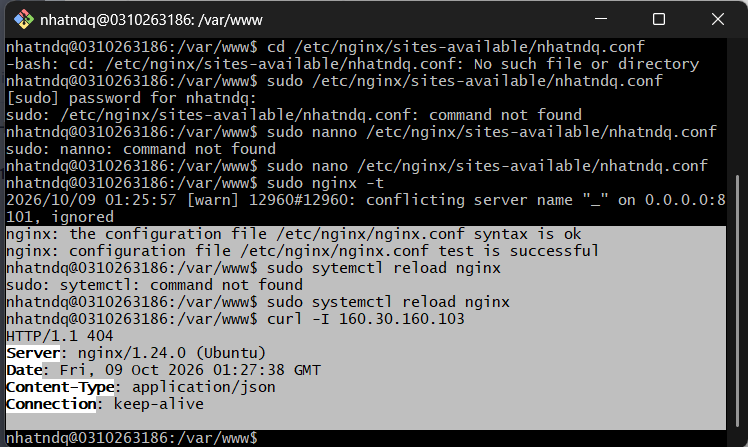
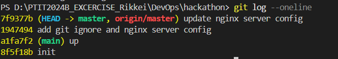

# DevOps hackathon - de 001: quan li phong lab

## thong tin sinh vien
| Ho va ten | Ma sinh vien | Lop | Tai khoan linux | Github | Cong nginx | 
| Nguyen Duy Quang Nhat | N24DTCN119 | HCM-KS24-CNTT1 | https://github.com/DevOps-NhatNDQ/devops-hackathon-NguyenDuyQuangNhat-de001.git | 8092 |

## Moi truong trien khai
he dieu hanh: ubuntu linux 24 lts
nginx version: nginx/1.24.0 (Ubuntu)
noi chay: vps

## cau rtuc du an: 

## cau hinh nginx

## tuong lua ufw
- rule da them: 8092, 8092/tcp
- ket qua `sudo ufw status verbose`:

## cac buoc trien khai

## kiem tra minh chung

## quy trinh cap nhat website
sua -> commit -> push -> git pull tren server ->kiem tra

## su co